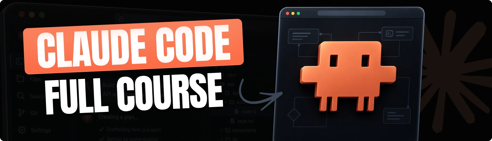

<div align="center">
  <br />
    <a href="https://youtu.be/u2QqWkMv3Lg" target="_blank">
      
    </a>
  <br />

  <div>


<br/>


<br/>


  </div>

  <h3 align="center">Build a Luxury Brand Storefront with Claude Code</h3>

   <div align="center">
     Build this project step by step with our detailed tutorial on <a href="https://www.youtube.com/watch?v=XUkNR-JfHwo" target="_blank"><b>JavaScript Mastery</b></a> YouTube. Join the JSM family!
    </div>
</div>

## 📋 <a name="table">Table of Contents</a>

1. ✨ [Introduction](#introduction)
2. ⚙️ [Tech Stack](#tech-stack)
3. 🔋 [Features](#features)
4. 🤸 [Quick Start](#quick-start)
5. 🔗 [Assets](#links)
6. 🚀 [More](#more)

## 🚨 Tutorial

This repository contains the code corresponding to an in-depth tutorial available on our YouTube channel, <a href="https://www.youtube.com/@javascriptmastery/videos" target="_blank"><b>JavaScript Mastery</b></a>.

If you prefer visual learning, this is the perfect resource for you. Follow our tutorial to learn how to build projects like these step-by-step in a beginner-friendly manner!

<a href="https://youtu.be/u2QqWkMv3Lg" target="_blank"></a>

## <a name="introduction">✨ Introduction</a>

A luxury e-commerce application built with Claude Code and PostgreSQL! Claude Code manages your codebase using CLAUDE.md project rules, Plan Mode for safe database migrations, and sandboxed permissions for security. Features a high-end luxury design system, custom reusable Skills, and parallel subagents tailored for developers who want to master real AI orchestration.

If you're getting started and need assistance or face any bugs, join our active Discord community with over **50k+** members. It's a place where people help each other out.

<a href="https://discord.com/invite/n6EdbFJ" target="_blank"></a>

## <a name="tech-stack">⚙️ Tech Stack</a>

- **[Better Auth](https://www.better-auth.com/)** is a framework-agnostic authentication and authorization library for TypeScript. It provides built-in support for email and password authentication, social sign-on (Google, GitHub, Apple, and more), and multi-factor authentication, simplifying user authentication and account management.

- **[Claude Code](https://docs.anthropic.com/en/docs/agents-and-tools/claude-code/overview)** is an agentic command-line tool by Anthropic that assists developers directly inside the terminal. It can understand codebase context, edit files, execute commands, run tests, and manage Git workflows to automate complex software engineering tasks using natural language.

- **[CodeRabbit](https://jsm.dev/claude-coderabbit)** is an AI-driven code review platform that integrates directly with pull requests on GitHub and GitLab. It provides line-by-line code reviews, summaries, potential bug detection, and automated test generation to accelerate code reviews and improve overall software quality.

- **[Drizzle ORM](https://orm.drizzle.team/docs/overview)** is a lightweight and performant TypeScript ORM designed with developer experience in mind. It provides a seamless interface between application code and database operations while maintaining high performance and reliability.

- **[Neon](https://neon.com/)** is a fully managed, serverless PostgreSQL database platform. It offers features like instant provisioning, autoscaling, and database branching, enabling developers to build scalable applications without managing infrastructure.

- **[Next.js](https://nextjs.org/docs)** is a powerful React framework for building full-stack web applications. It simplifies development with features like server-side rendering, static site generation, and API routes, enabling developers to focus on building products and shipping quickly.

- **[PostgreSQL](https://www.postgresql.org/)** is a powerful, open-source relational database system known for its reliability, data integrity, and robust feature set. It supports advanced data types, full ACID compliance, and extensibility, making it suitable for a wide range of applications.

- **[TypeScript](https://www.typescriptlang.org/)** is a superset of JavaScript that adds static typing, providing better tooling, code quality, and error detection for developers. It is ideal for building large-scale applications and enhances the development experience.

- **[Tailwind CSS](https://tailwindcss.com/)** is a utility-first CSS framework designed for rapidly building custom user interfaces. Instead of providing pre-styled components, it offers low-level utility classes for layout, typography, color, and spacing directly within your markup, streamlining styling and enforcing consistent design systems.


## <a name="features">🔋 Features</a>

👉 **Landing Page**: A fast, engaging homepage for a luxury storefront that introduces your brand and products, serving as the starting point to learn how Claude Code reads and navigates your codebase.

👉 **Design System & Components**: A structured set of UI components where you learn how permissions control what files, environment variables, and tools your agent can access.

👉 **Auth Pages**: Secure and seamless user signup, login, and password recovery powered by Better Auth, demonstrating how to guide your agent through sensitive security integrations.

👉 **Database Setup & Products**: Product listing and detail pages backed by PostgreSQL (Neon), built using Claude Code’s Plan Mode to architect and approve complex database schemas before executing code.

👉 **Reusable Workflows (Skills)**: Interactive features—like cart management with Zustand—used to transform repetitive development processes into reusable Claude Code Skills.

👉 **Advanced Architecture & Subagents**: Complex workflows (order processing, review features, and deep codebase investigations) divided across specialized subagents to prevent context overload.

And many more, including code architecture and reusability.

## <a name="quick-start">🤸 Quick Start</a>

Follow these steps to set up the project locally on your machine.

**Prerequisites**

Make sure you have the following installed on your machine:

- [Git](https://git-scm.com/)
- [Node.js](https://nodejs.org/en)
- [npm](https://www.npmjs.com/) (Node Package Manager)

**Cloning the Repository**

```bash
git clone https://github.com/adrianhajdin/atelier-store.git
cd atelier-store
```

**Installation**

Install the project dependencies using npm:

```bash
npm install
```

**Set Up Environment Variables**

Create a new file named `.env` in the root of your project and add the following content:

```env
# Neon Postgres (https://console.neon.tech) - use the pooled connection string
DATABASE_URL=""

# Better Auth - generate with: openssl rand -base64 32
BETTER_AUTH_SECRET=""
BETTER_AUTH_URL="http://localhost:3000"

# Public app URL (client-side)
NEXT_PUBLIC_APP_URL="http://localhost:3000"

STRIPE_SECRET_KEY=""
STRIPE_WEBHOOK_SECRET=""
```

Replace the placeholder values with your real credentials. You can get these by signing up at:
- **Neon Postgres:** [neon.tech](https://console.neon.tech)
- **Stripe:** [dashboard.stripe.com](https://dashboard.stripe.com)

**Running the Project**

```bash
npm run dev
```

Open [http://localhost:3000](http://localhost:3000) in your browser to view the project.

## <a name="links">🔗 Assets</a>

Assets and snippets used in the project can be found in the **[video kit](https://jsm.dev/claude-kit)**.

<a href="https://jsm.dev/claude-kit" target="_blank">
  
</a>

## <a name="more">🚀 More</a>

**Advance your skills with Next.js Pro Course**

Enjoyed creating this project? Dive deeper into our PRO courses for a richer learning adventure. They're packed with
detailed explanations, cool features, and exercises to boost your skills. Give it a go!

<a href="https://jsm.dev/claude-engineer" target="_blank">
  
</a>
